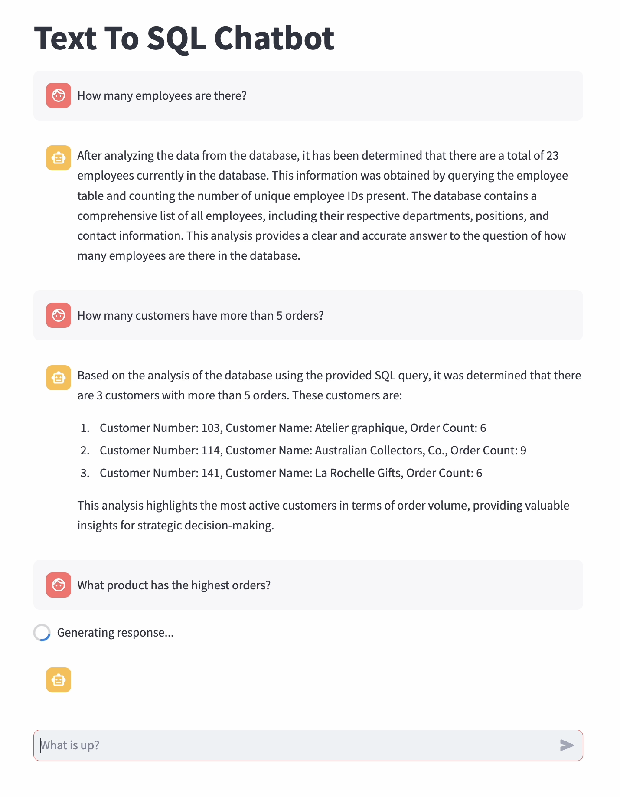

# Text to SQL Project

## Overview
This project demonstrates the implementation of a **Natural Language to SQL (NL2SQL)** system, allowing users to input natural language queries and receive SQL commands to retrieve data from a database. The project uses the [MySQL Sample Database](https://www.mysqltutorial.org/getting-started-with-mysql/mysql-sample-database/) for testing and validation.

The foundation of the system is built on **GPT-3.5-turbo**, a state-of-the-art natural language model, which is fine-tuned and customized to achieve better accuracy in SQL generation. The system includes features like **Few-Shot Learning**, **Dynamic Example and Table Selection**, and **Memory-Enabled Conversations** for a seamless user experience.

## Demo Video
[](./assets/TextToSQLDemo.mov)

## Features
### 1. **Building a Basic NL2SQL Model**
- The system translates natural language queries into SQL commands using the GPT-3.5-turbo model.

### 2. **Incorporating Few-Shot Learning**
- The model's accuracy is enhanced by providing a set of example queries and their corresponding SQL commands during the prompt.

### 3. **Dynamic Few-Shot Example Selection**
- The examples provided to the model are dynamically selected based on the context of the user's query to improve relevance and performance.

### 4. **Dynamic Relevant Table Selection**
- The system identifies which tables in the database schema are relevant to the user's query, ensuring precise SQL generation.

### 5. **Customizing Prompts and Responses**
- Fine-tuned prompts ensure that the model generates clear and concise SQL commands, as well as human-readable responses when necessary.

### 6. **Adding Memory to Chatbots**
- The system retains context across user queries, allowing for follow-up questions and maintaining a coherent conversation flow.

### 7. **Agent-Based Reporting Workflow**
- After generating an SQL query, using Crew AI for multi agent AI system
  1. **Research Agent:** Executes the SQL query against the database to fetch results and performs additional research as required.
  2. **Report Agent:** Prepares a detailed, user-friendly report based on the results and any supplementary information.

## Prerequisites
### Tools and Technologies
- **Python 3.8+**
- **MySQL Database** (using the [MySQL Sample Database](https://www.mysqltutorial.org/getting-started-with-mysql/mysql-sample-database/))
- **OpenAI API Key** for GPT-3.5-turbo

### Setting Up the MySQL Sample Database
1. Download the MySQL Sample Database scripts from the [official site](https://www.mysqltutorial.org/getting-started-with-mysql/mysql-sample-database/).
2. Import the SQL script into your MySQL server:
   ```bash
   mysql -u <username> -p 

## Run
```bash
   streamlit run ./Langchain\ NL2SQL\ Chatbot/app/main.py
```
The logs are collected in crew.log. The ER diagram of the database used is present in the assets folder.
